# PACEXT-6 

## PAC – Projeto de Aprendizagem Colaborativa Extensionista  
Curso de Engenharia de Software – Católica de Santa Catarina

---

## Autores
- Eder Duarte Zerek  
- José Lucas A. Fonseca  
- Leonardo Henrique Nascimento  
- Luis Felipe Fachini  
- Max Buzzarello Maul  
- Sidney Cardoso de Oliveira Junior  

## Professores Orientadores
- Luiz Carlos Camargo  
- Claudinei Dias  

---

## Justificativa do PAC e Entidade Beneficiada

O projeto foi desenvolvido para uma esteticista autônoma que trabalha com serviços faciais, venda de produtos e atendimento personalizado.  
Antes da criação do sistema, suas operações eram realizadas exclusivamente por mensagens e redes sociais, dificultando:

- organização do catálogo de produtos;  
- controle de estoque;  
- gerenciamento de pedidos;  
- acompanhamento de vendas;  
- comunicação estruturada com clientes.

O sistema proposto oferece uma plataforma centralizada que profissionaliza e simplifica essas tarefas, contribuindo diretamente para a eficiência do atendimento da entidade beneficiada.

---

## Descrição do App

O sistema consiste em uma aplicação web desenvolvida em Laravel com MySQL, voltada para auxiliar na gestão de produtos, serviços e fluxo de vendas da esteticista.

### Funcionalidades implementadas

#### Área do Cliente
- Cadastro e autenticação de usuários  
- Recuperação de senha  
- Catálogo de produtos  
- Catálogo de serviços estéticos  
- Visualização de detalhes de produtos  
- Carrinho de compras  
- Finalização de pedidos  
- Integração com redes sociais  
- Interface intuitiva e responsiva  

#### Área Administrativa
- Cadastro de produtos  
- Edição de produtos  
- Remoção de produtos  
- Controle de estoque  
- Cadastro e edição de serviços  
- Visualização de pedidos recebidos  
- Gerenciamento geral do catálogo  

### Tecnologias utilizadas
- Laravel  
- Livewire  
- PHP 8+  
- MySQL  
- Blade Templates  

---

## Requisitos para Preparar o Ambiente de Desenvolvimento

### Tecnologias Necessárias
- PHP 8.0 ou superior  
- Composer  
- MySQL ou MariaDB   
- Git  
- XAMPP, WAMP ou Laragon  

### Passos para Configuração


```bash
git clone https://github.com/sidneyoliveiraj/PACEXT-6
cd PACEXT-6

composer install
cp .env.example .env
php artisan key:generate

php artisan migrate --seed

php artisan serve

```

O sistema ficará disponível em:
http://localhost:8000

## Prints das Principais Telas do App

Tela Inicial

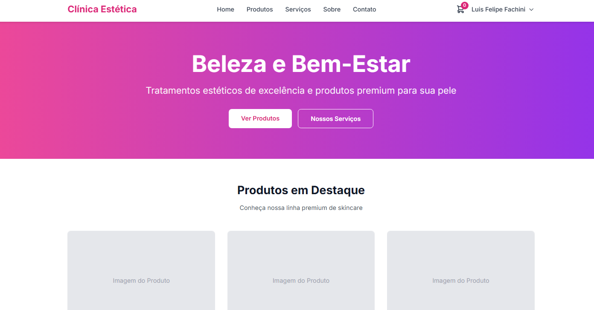
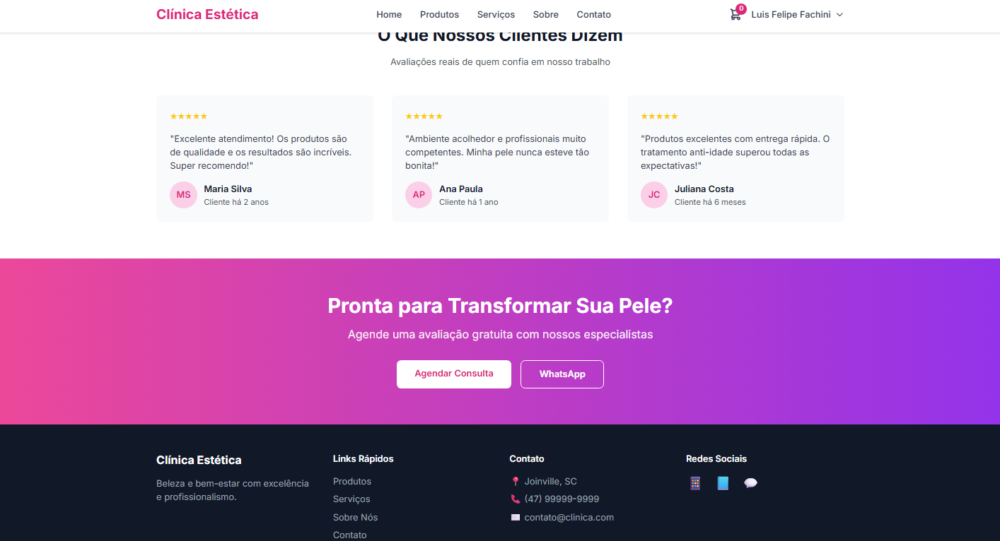

Página principal da clínica, com banner de destaque, botões para ver produtos e serviços, vitrine de produtos em destaque e depoimentos de clientes, finalizando com chamada para contato/WhatsApp.

Tela de Login

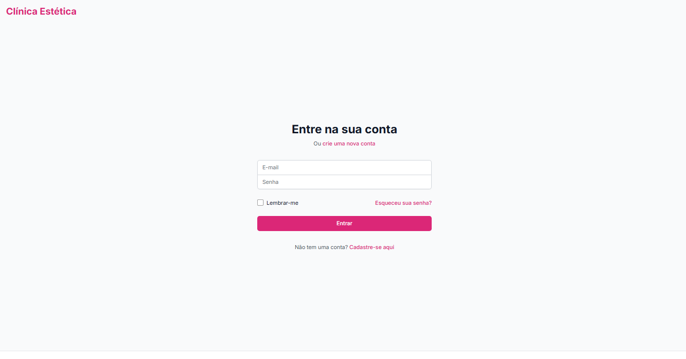
Tela para o cliente acessar sua conta, informando e-mail e senha, com opção de lembrar login e link para recuperar a senha ou criar uma nova conta.

Tela de Cadastro

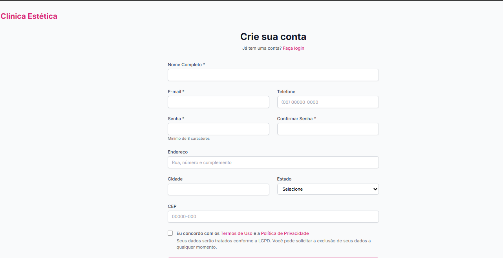
Formulário completo para criar conta de cliente, com campos de dados pessoais, endereço, contato, senha e aceite dos termos de uso e política de privacidade.

Catálogo de Produtos

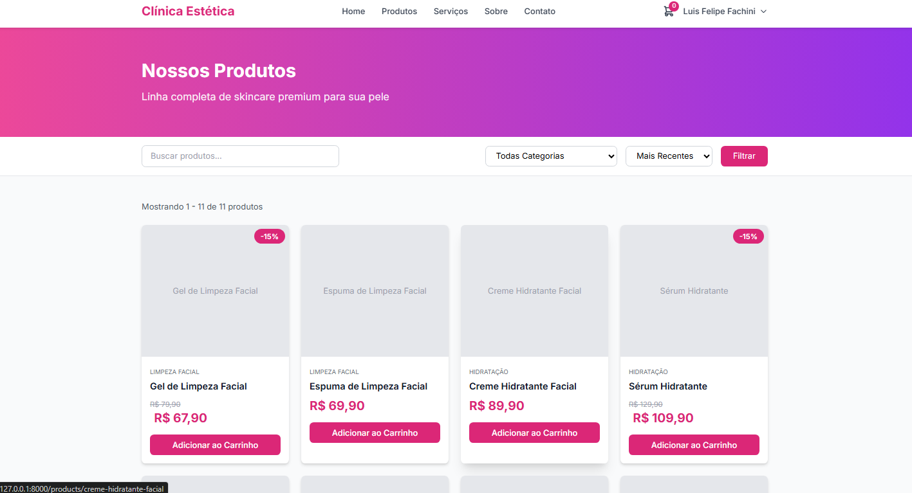
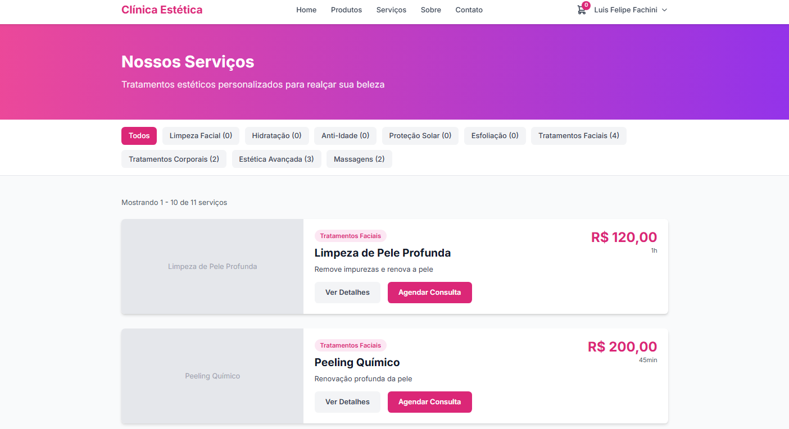
Listagem de produtos de skincare com filtros por categoria e ordenação, barra de busca e cards com nome, preço, desconto e botão para adicionar o item ao carrinho
e tela que apresenta os serviços estéticos oferecidos, com filtros por tipo de tratamento e lista de serviços mostrando nome, descrição resumida, preço e botão para ver detalhes ou agendar.

Detalhes do Produto

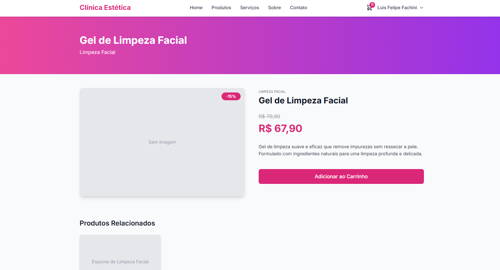
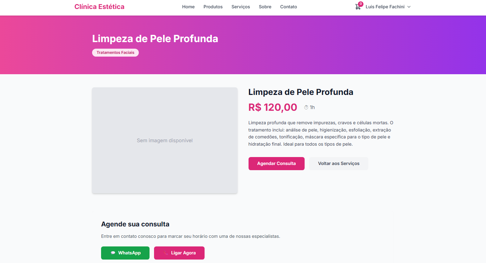
Página de detalhes de um produto específico, exibindo imagem, categoria, descrição, preço promocional e botão para adicionar o item ao carrinho, além de produtos relacionados
e página com a descrição completa do serviço, preço, duração e benefícios, além de chamada para agendar consulta e atalhos para contato via WhatsApp ou ligação.

Carrinho de Compras

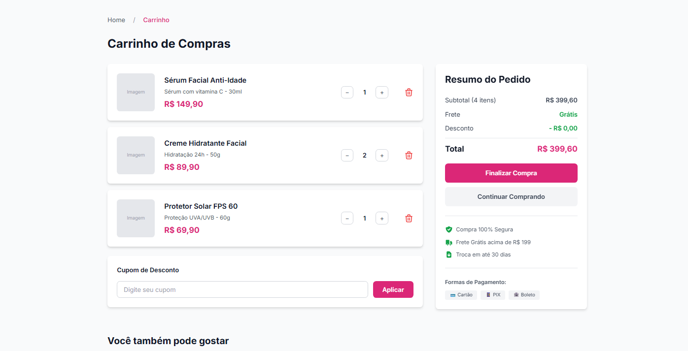
Resumo dos produtos selecionados com quantidade, valores individuais, subtotal, frete, desconto, campo para cupom e painel de finalização de pedido com formas de pagamento.

Área Administrativa

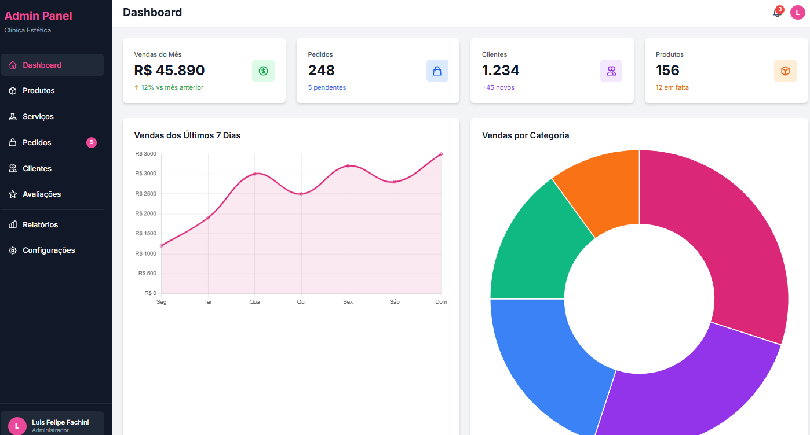
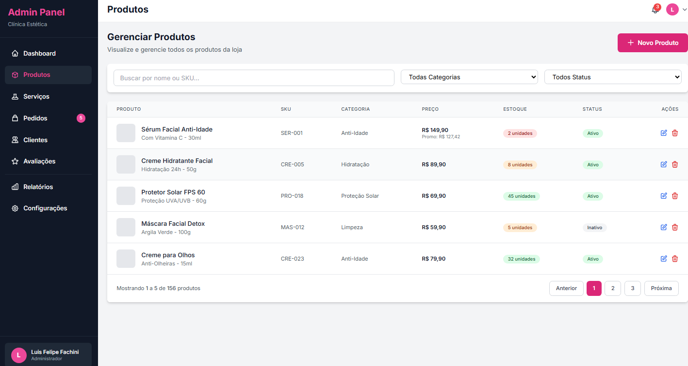
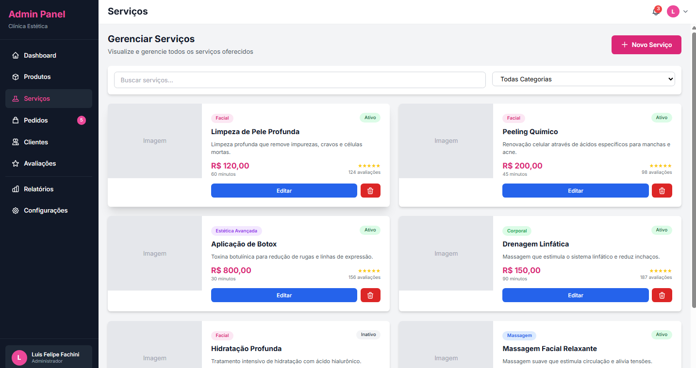
Reúne todas as ferramentas de gestão do sistema, permitindo ao administrador visualizar métricas gerais da loja, acompanhar vendas e pedidos, gerenciar produtos e serviços e acessar informações de clientes e avaliações. O painel oferece uma visão clara do desempenho do negócio, com gráficos atualizados, status de estoque, filtros avançados e ações rápidas para edição ou exclusão de itens. Tudo foi organizado para facilitar a operação diária da clínica e manter o controle completo das funcionalidades internas do sistema.


## Vídeo de Demonstração do APP

Link do vídeo:
